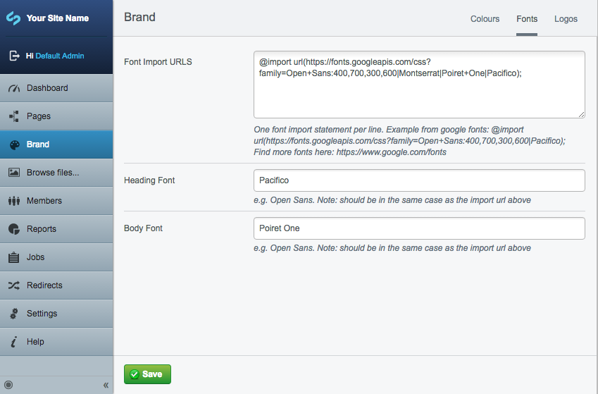
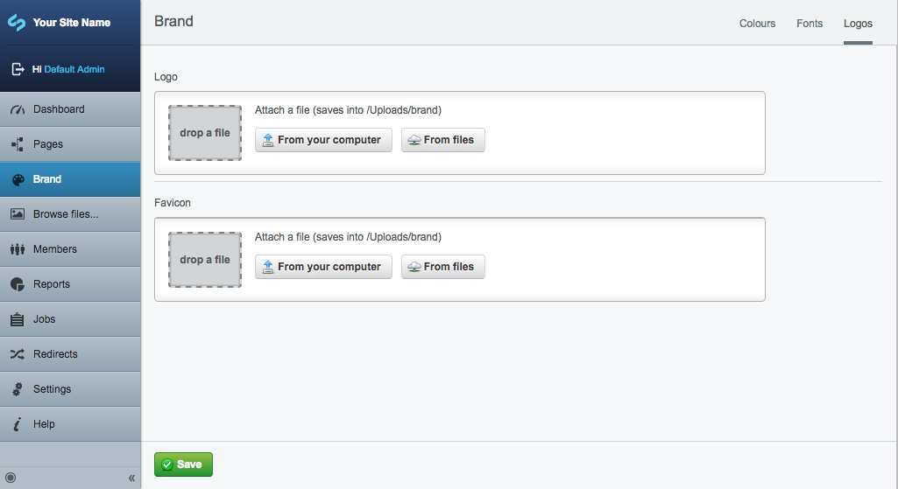

# Silverstripe Brand module

A module to assist with a website's basic branding. Allows setting of brand colours and fonts from within a Silverstripe Admin.

## Requirements

SilverStripe 3.3 or higher

## Installation

``composer require adrexia/brand``

## Setup
Include the brand template in the head of you page template:  
``<% include Brand %>``

By default this includes the fonts and the font-color. The Palette colours are for use on other page types, or for custom theming. For example, they can be used to add a restricted colourpalette to a page (with the help of the Color Palette module):

	$brand = Brand::get()->First();

	if($brand) {
		$fields->insertAfter(
			ColorPaletteField::create(
				"Color", "Color", $brand->getPalette()
			), "Intro"
		);
	}

There is an extension 'BrandPageExtension' included for this purpose which adds a brand colour, a contrast colour, and an image. To enable it, add this to your _config.yml file:

	Page:
	  extensions:
	   - BrandExtension

The other variables provided can be called in a template with:  
``$Brand.Logo``   
``$Brand.BodyBackgroundColour``

To get the hex value of a colour from a colourpalette in youir template you can do something like this:

	<% if $Colour %>$Brand.getColorFromPalette($Color)<% else %>$Brand.getColorFromPalette($Level(1).Color)<% end_if %>

## Subsite support
This module can work with subsites with the addition of the SubsiteModelExtension from adrexia/subsite-modeladmins (specifically, the onBeforeWrite and augmentSQL functions). You can install this via composer require, or just take the bits you need:

``composer require adrexia/subsite-modeladmins``

### Setup: 

	Brand:
	  extensions:
	   - SubsiteModelExtension

## Screenshots

